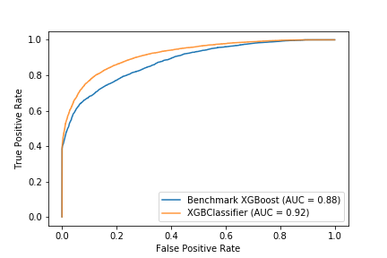

```{r setup, include=FALSE}
knitr::opts_chunk$set(echo = FALSE)
```

# Capstone Project: Prediction of Hotel Booking Cancellations

## I. Definition

### Project Overview

This project seeks to adress a major point of planning efforts in hospitality management: the prediction of booking cancellations. 
Within the project, historical data of cancelled and checked-in hotel bookings is explored for interesting relationships and utilized in machine learning models to predict whether a customer will cancel their booking. 

The dataset used for this project will be the Hotel booking demand dataset [@kaggle], hosted on kaggle.com, originally published in @antonio2019hotel. 
It contains booking information from two different portugese hotels, one based in a city, the other being a resort hotel. 
The focus will lie on the target variable - which describes whether a booking was cancelled before the customer arrived or not. 
Additionally, the dataset includes information about the booking and its associated customers - like the number of adults and children, over which travel agent the booking was made, the date of the booking or the average daily rate for the customer. 

A hotel needs to take future cancellations into account when they allow a customer to book a room. 
Due to this, a hotel tends to be overbooked by default, building upon the assumption that some customers will not actually arrive. 
If a hotel predicts cancellations inaccurately, by overestimating the actual number of canceled bookings, customers would be need to be turned away upon their arrival. 
Similarily, if the predicted number is undererstimating the actual number of cancellations, the hotel could operate on too little capacity and lose money. 
As such, the prediction of cancellations is a forecasting problem with high business impact. 

### Problem Statement

Predicting churn is a very important part of every subscription based business, which is often addressed by modern machine learning solutions. 
Prominent examples are often found in telecommunications [@huang2012customer].
The general problem formulation can be transferred to other domains, for example hospitality management. Here, churn translates to cancellations of bookings. 
Since this translates very directly to a loss of revenue, the accurate prediction of cancellations is of very high importance for such businesses. 

For hospitality management, the accurate prediction of a cancellations prior to the anticipated check-in date is very important.
In this context, the problem to be solved is the prediction of a cancellation probability $P(Y_i \vert X_i)$ of a customer $i$, given a set of features $X_i$. 
Thus, the problem is a two-class classification problem, allowing the performance of solutions to be quantitatively evaluated by evaluation metrics like accuracy, precision or recall. These solutions are two-class classification models.
An implementation should be able to accurately and repeatedly classify customers based on the given features. 
Along with accurate predictions, it can be of major importance to identify possible drivers of cancellations, so that possible 
opportunities for actions can be derived from a machine learning solution. 
As an example, a prediction model could generate next best offers for customers at the point of booking, possibly reducing the probability of a later cancellation. 

### Metrics

The project's solution will be evaluated against the area-under-the-ROC-curve (AUC) score, as well as the accuracy. 
The ROC-curve is the model's recall against the false positive rate, which is equal to $(1 - Specificity)$ at various threshold settings. 
The AUC is calculated for the ROC-curve to give a total score for the model. 
Additionally, different classification measures and their importance and implication in the context of the underlying business case will be discussed.

Following @fawcett2006introduction, the accuracy is defined as
$$\text{Accuracy} = \frac{\text{True Positives } + \text{ True Negatives}}{\text{Positive } + \text{ Negatives}}$$,
where the nominators are equivalent to correctly classifying positive and negative observations respectively, while the denominator's variables are the numbers of real positive and negative observations in the data.  
Recall and specificity, which are needed for calculating the ROC-AUC score, are defined as 
$$\text{Recall} = \frac{\text{True Positives}}{\text{True Positives } + \text{ False Negatives}},$$ and  
$$\text{Specificity} = \frac{\text{True Negatives}}{\text{True Negatives + False Positives}}$$  
respectively. Again, _True Positives_ denote the number of correctly classified positive cases, i.e. correctly predicted booking cancellations, while _True Negatives_ denote the number of correctly classified negative cases, i.e. customers who were predicted not to cancel their bookings and did not cancel. _False Negatives_ and _False Positives_ are wrongly classified negative and positive cases respectively. 

For this problem, it is also worth considering precision, defined as 
$$\text{Precision} = \frac{\text{True Positives}}{\text{True Positives + False Positvies}}$$. 
This is important, because it is valid to assume cancellations to occur much less frequently in booking data than actual check-ins. Where accuracy allows for measurement of the model's ability to separate the two classes, precision tells us how well the model is at predicting the less-often occurring class. 


\newpage
## II. Analysis

### Data Exploration

The dataset utilized is a publicly available data set hosted on Kaggle [@kaggle], originally published in @antonio2019hotel. The original data was cleaned and prepared by @tidytuesday. It holds 119390 observations of 32 variables.
Since the data is a result of an exercise in data cleaning and manipulation, only minimal preprocessing is needed to enable predictive modeling with this data. 
There are no real missing values in the dataset that contain actually missing information. Instead, empty values indicate the non-existence of the specific attribute in that case. For example, the variable `children` has some null values. 
However, that does not mean there are actually missings for that variable. Instead, this simply implies that there are zero children associated with a booking. 

Overall, this means there is not a lot of data cleaning needed to start working with the presented data. 
Nonetheless, the data will be explored further in the following section.
To start off, the data includes numerical and categorical data. Table 1 shows a list of categorical variables, while Table 2 shows numerical default. 
Due to the large number of variables present, no specific observation will be showcased as example. Instead, the tables will help illustrate general implications and contents of the data

```{r message=FALSE, warning=FALSE}
library(dplyr)
library(knitr)
library(kableExtra)
df <- read.csv("VarDesc.csv")
df_cat <- filter(df, Type == "categorical")
kable(df_cat, 
      "latex", 
      booktabs = T,
      caption = "Overview of the categorical variables present in the dataset"
      ) %>% 
  column_spec(3, width = "6cm")
```

Table 1 is already assuming some preprocessing, as the variable `agent` in the dataset is a numerical encoding of the ID of the travel agency that made the booking. 
However, this information is categorical, as there is no logic behind differences in the numerical values. 
This means the agent variable needs to be preprocessed into a categorical variable before being used in a model, so we can later one-hot encode them accordingly.
Similarly, the `company` variable is also an encoded ID of a company through which the booking was made. 
As the numerical values are not accurate representations, this variable also needs to be treated as a categorical variable.
Additionally, the target variable is already encoded into a numerical value, as needed for the modeling. 
The information behind that is inherently categorical, as a one denotes a canceled booking, while a zero was not canceled. 
The categorical variables `reservation_status` and `reservation_status_date` are variables which could provide target leakage in the modeling phase and as such need to be removed at a later point in the feature preprocessing. 

```{r message=FALSE, warning=FALSE}
df_num <- filter(df, Type == "integer" | Type == "float")

kable(df_num, 
      "latex", 
      booktabs = T,
       caption = "Overview of the numerical variables present in the dataset"
      ) %>% 
  column_spec(3, width = "6cm")
```

Table 2 showcases numerical variables in the data. Besides the already discussed target variable, there exists information about the arrival dates, general information about the length of stay, the customer's family, and pricing. 
Furthermore, there is also information not to be considered in the modeling phase. The variables `booking_changes` change with a booking over time, so it should be removed to avoid leakage. 

```{r}
na_df <- data.frame(
  Variable = c("children", "country", "agent", "company"),
  NAs = c(4, 488, 16340, 112593))

kable(na_df,
      "latex",
      booktabs = T,
      caption = "Number of NA-Values per Variable with NA-Values present",
      col.names = c("Variable", "# of NA-Values")) # %>% 
  #column_spec(3, width = "6cm")
```

Table 3 shows the missing values present in the data set in more detail. 
The country variable does not need to be filled at the time of booking, so NA values can occur here and need to be replaced.
If an agent variable is NA, it means that the booking was not made via an agent, which is information as well.
Similarly, if company is NA, the booking was made by a private customer. 
The four children NA values will be set to zero for the modeling. 
Additionally, in the meal column, there exist two ways to display the same information. Undefined is equal to SC, so we will need to replace Undefined with SC. 
Utilizing knowledge required at a later stage, we will also remove observations with 0 customers.

In general, to create a better understanding of the data, some statistics can be reported. In general, the ratio of canceled bookings in the data is 36.08 %, while the non-canceled booking make up 62.92 % of the data. 
While this shows that the classes are not exactly balanced in a 50/50 split, the data is far from a truly unbalanced classification problem. 
This means the problem does not require additional methods of balancing the data prior to modeling. 
Furthermore, this includes the advantage of being a very realistic representation of the business problem behind the use case. 

```{r message=FALSE, warning=FALSE}
library(readr)
hotel_bookings <- read_csv("data/hotel_bookings.csv")

sumry <- data.frame(
  Variable = "adr",
  Min = min(hotel_bookings$adr),
  First_Quantile = quantile(hotel_bookings$adr, probs = 0.25)[1][[1]],
  Median = median(hotel_bookings$adr),
  Third_Quantile = quantile(hotel_bookings$adr, probs = 0.75)[1][[1]],
  Max = max(hotel_bookings$adr),
  mean = mean(hotel_bookings$adr),
  sd = sd(hotel_bookings$adr)
)

kable(sumry,
      "latex",
      booktabs = T,
      caption = "Summary Statistics for the adr Variable",
      col.names = c("Variable", "Min", "First Quantile", "Median", "Third Quantile", "Max", "Mean", "Standard Deviation"))
```

Table 4 shows a closer look at the summary statistics of the `adr` variable, which highlights some irregularities. 
For example, the minimum value of the daily rate should not be negative and the maximum value of 5400 seems to be an irregularity as well. 
For later analysis, these values will be removed, as they seem untrustworthy and might be due to an error in the booking system. 


### Exploratory Visualization

The data is a collection of bookings from two portugese hotels. With the categorical variable `hotel`, the hotel specific ratios of cancellations can be analyzed. Figure 1 shows the distribution of bookings between hotels on the left hand side, while it offers an additional look at the distribution of cancellations between the two hotels on the right hand side. 

```{r, out.width = "450px", fig.cap="Booking Distribution by Hotel"}

```

An important takeaway from Figure 1 is the fact that the city hotel is responsible for a larger amount of bookings. 
This makes sense, as there is more likely to be a high turnover of guests in a city based hotel, than in a resort hotel. 
Additionally, this could also be explained by longer stays in resort hotel, as these stays tend to be longer.  
Interestingly enough, the ratio of canceled bookings is also higher for the city hotel. 
This is an indicator that any model should make use of the hotel variable. 

```{r, out.width = "450px", fig.cap="ADR Distribution by Hotel and Target Variable"}

```

Figure 2 visualizes the distribution of the variable `adr`, the average daily rate of a stay, which is defined by dividing the sum of all lodging transactions by the total number of staying nights, against the two hotel variables and for canceled and non-canceled bookings. 
The figure indicates a smaller spread of the lodging price for canceled city hotel bookings. 
This could indicate special cheaper offers, which might result in more frequent cancellations, as these bookings might be more spontaneous in nature.
For the resort hotel, the distributions do not differ a lot in shape. For the non-canceled bookings, there seems to be a larger density of observations around its median value, while the canceled bookings are distributed a bit more evenly. 

```{r, out.width = "450px", fig.cap="ADR Distribution by Hotel and Target Variable"}

```

Figure 3 showcases the distribution of the variable `lead_time`, which is defined as the number of days that elapsed between the entering date of the booking into the booking system and the arrival date, against the two hotel variables and grouped by the target variable. 
Interestingly enough, the median values of the distributions are higher for canceled bookings, meaning bookings made longer ahead of time were canceled more frequently. Additionally, the distribution the lead time of canceled bookings is shaped more evenly than their counterparts. Taking this into account, `lead_time` can be considered an important variable for the modeling process as well. 

### Algorithms and Techniques

In the modeling process, the XGBoost algorithm will be utilized for modeling [@xgboost].
The present data is standard tabular data, which is an area where XGBoost often outshines other simpler methods like logistic regressions, but also does not fall behind more complex methods, like neural networks. 
It is often used in competitions with tabular data, where it tends to beat out other methods consistently. 
XGBoost is a decision-tree-based ensemble machine learning algorithm utilizing a gradient boosting framework, essentially a further development of trees compared to random forests.
Furthermore, we will utilize cross-validation within the training data for randomized hyperparameter-tuning to build the final predictive model. 
This allows for even better performance of the model, while not overfitting to the training data. 
Additionally, XGBoost is also easily available on AWS SageMaker, meaning such a solution could very well be integrated in actual real-world systems.
In regards to the data utilized, the data will be split into training/test in a ratio of 80/20, with final results being reported on the test set.

### Benchmark

In the modeling, XGBoost will be applied to the data and tuned in regards to its hyperparameters. As such, in Chapter III a simple XGBoost model will be introduced as a benchmark for the hyperparameter tuning. 
The general benchmark is a zero-rule based voting on the test set. This is simply classifying every observation as the majority class, which is 0 in this case. 
Such a benchmark produces an accuracy of 62.55 % and a ROC AUC score of 50% on the test data, which holds 23480 observations. 

\newpage
## III. Methodology

### Data Preprocessing

As mentioned above, the data requires very little preprocessing, as it is the result of such an exercise.
However, there are still some values data points which need to be taken care of. 
There are certain null values, as well as wrong observations and categorical variables yet to be encoded as such. Their treatment will be discussed, as well as further feature preprocessing. 

Since they are believed to be wrong observations, the dataset is filtered for observations with only possible values for the variable `adr`, as well as values for `adr` less than 5200. The variable `meal` holds the attribute `'Undefined'`, which means the same as the attribute `'SC'`, meaning the former are set to the latter.
Additionally, observations where the sum of the numbers of adults, children and babies equal zero are removed from the data, as this would mean that there are no actual customers associated with the booking. 

NA values that need to be replaced were also discussed.  

- In the variable `agent`, these values are set to 0.
- In the variable `comapny`, these values are set to 0.
- In the variable `country`, these values are set to `'None'`.
- In the variable `children`, these values are set to 0.

Furthermore, the variable `agent` was reduced in the space of its attributes. Since there is a very large number of possible travel agents, the variable was aggregated to its top eight attributes plus an additional filler attribute for the small agencies. 
Afterwards, the variables `agent` and `company` were transformed to be of type `object`, to better capture there nature as categorical variables. 
The categorical variables in the model are one-hot encoded to dummy variables, using the `pd.get_dummies()` method.

The final feature set in the models, depending on the variable type is as follows:  

Numerical:

- `lead_time`, 
- `arrival_date_week_number`, 
- `arrival_date_day_of_month`,
- `stays_in_weekend_nights`, 
- `stays_in_week_nights`, 
- `adults`, 
- `children`,
- `babies`, 
- `is_repeated_guest`, 
- `previous_cancellations`,
- `previous_bookings_not_canceled`, 
- `company`,
- `required_car_parking_spaces`, 
- `total_of_special_requests`, 
- `adr`

Categorical:

- `hotel`, 
- `agent`,
- `arrival_date_month`,
- `meal`,
- `market_segment`,
- `distribution_channel`,
- `reserved_room_type`,
- `deposit_type`,
- `customer_type`

After one-hot encoding, the final feature space is 72 variables. 

### Implementation

In terms of implementation, multiple methods from scikit-learn were utilized. 
The initial data split between training and testing data was done with the train_test_split function from `sklearn.model_selection`, for the hyperparameter tuning, the functions `KFold`, `cross_validate`, `cross_val_score` and `RandomizedSearchCV` were also imported. 
The functions for metrics were also imported from scikit-learn. More precisely, the functions `accuracy_score`, `f1_score`, `roc_auc_score`, `precision_score` and `recall_score` from `sklearn.metrics` were imported. 
For the actual modeling, `XGBClassifier` was imported from the python package `xgboost`.

After preprocessing the features and splitting the data in training and testing, the training data was utilized for a first simple `XGBClassifier` fit. Afterwards, predictions were carried out on the test data and the respective metrics calculated. 
In the next step, `RandomizedSearchCV` was used to tune hyperparameters over a set of randomly generated parameter-sets, to produce a final candidate model which was again used for carrying out predictions on the test set, before then calculating the appropriate metrics. The randomized sets of parameters were drawn from their respective distributions via the `stats` module from the `scipy` package.

### Refinement

The initial xgboost classifier was estimated with a fairly standard set of parameters. More precisely, these were: 

- colsample_bylevel=1,
- colsample_bynode=1,
- colsample_bytree=1,
- gamma=0,
- learning_rate=0.1, 
- max_delta_step=0, 
- max_depth=3,
- min_child_weight=1, 
- missing=None, 
- n_estimators=100.

The model produced an accuracy of 82.13 % and a ROC AUC score of 88.03 % on the testing dataset. 

In the randomized hyperparameter search, the set of parameter searched were:

- n_estimators: random integers between 150 and 1000
- learning_rate: floats drawn from a uniform distribution between 0.01 and 0.6
- subsample: floats drawn from a uniform distribution between 0.3 and 0.9
- max_depth: a list of integer values from 3 to 9
- colsample_bytree: floats drawn from a uniform distribution between 0.3 and 0.9
- min_child_weight: a list of integer values from 1 to 4

The randomized parameters were drawn via the `stats.uniform` and `stats.randint` functions from the `scipy` package for the floats and integer values respectively.
The number of iterations in the `RandomizedSearchCV` function were set to 25.
The different estimators are valuated against their ROC AUC score on the cross validation holdout sets.

After fitting, the function allows us to extract different estimators fitted via the `fit` method of the `RandomizedSearchCV` object. 
Most importantly, we can extract the best estimator fitted with this method, which is the final model. 
In terms of accuracy, the final model produces a score of 85.26 % and a ROC AUC score of 91.89 % on the test data.
Especially in terms of the ROC AUC score, the gain of over 6 % over the basic xgboost model is quite significant. 
The accuracy could also be improved by over 3 %.

\newpage
## IV. Results

### Model Evaluation and Validation


Following the model's test results, it was able to correctly predict whether a booking was going to be canceled or not with an accuracy of 85.96 %, meaning a large portion of the observations could be correctly predicted. 
In light of the underlying business problem, the solution's precision of 83.29% is also very important, as it shows that that percentage of positively predicted values were actually canceled bookings, together with a recall of 77.84 %. 
Since the problem is not balanced according to a strict 50/50 rule, this result is very impressive and shows its potential value in a real application.

The final model has a `n_estimators` value of 778, a `learning_rate` value of 0.3226, a `subsample` value of 0.9511, a `max_depth` value of 5, a `colsample_bytree` value of 0.6911 and a `min_child_weight` of 4 for the searched parameter space. The other parameters were set as in the standard xgboost classifier.

The general estimation technique evaluates model fits in a cross-validation procedure. As such, the resulting candidate models come with an out-of-sample performance before being evaluated on the test set. 
As a result of this, the model results are quite robust, given a common direction of evaluation in both cross-validation and test performance, indicating a strong ability to generalize to unseen data, as well as showcasing trustworthiness of the results.

### Justification

The zero rule benchmark model produced an accuracy of 62.55 %, plus a ROC AUC score of 50 %. With the reported results of the hyperparametertuned model of an accuracy of 85.96 % and an ROC AUC score of 84.30 %, a substantial and significant increase over the benchmark could be produced. 
In addition to the final models performance on these metrics, its precision and recall metrics show that there is a very real potential benefit of implementing it in a real world business scenario. 

All in all, these evaluation metrics show that the tuned xgboost model is a significant enough solution to the illustrated problem. This means such a model is indeed able to classify potential hotel booking cancellations with a performance that could help generate business value for a hotel company.

\newpage
## V. Conclusion

### Free-Form Visualization

Figure 4 illustrates the ROC curves of the basic xgboost model without any parameter tuning in comparison to its successor model, the xgboost model with hyperparameter tuning. 
In general, the ROC curve plots the the True Positive Rate against the False Positive Rate, given a model's predicted classification probabilities. 
In this way, classification models can be evaluated not just for exact classifications, but also in regards to probability thresholds. 
The closer a model's graph is to the top left point, the better. 

```{r, out.width = "350px", fig.cap="ROC Curve of Tuned XGBoost and Basic XGBoost"}

```

Figure 4 shows how the tuned xgboost model strictly outperforms its non-tuned counterpart, as it has a higher True Positive Rate for any given False Positive Rate. 
Considering the ease of implementation and comparably low cost of computing, such a tuned model offers a very fast improvement on a simple starting model. 


### Reflection

For this project with the goal of accurately predicting canceled hotel bookings, hotel booking demand data was first acquired from Kaggle.com. 
Afterwards, the relevant target variable and its potential predictors were analyzed in an exploratory matter, to motivate possible modeling decisions and find potential anomalies in the data. 
Afterwards, these findings were utilized in a feature engineering and preprocessing step, so that a numerical matrix of predictors was built. 
This data was split into training and testing data. 
The former was used in a cross-validation training phase, to produce a final model, which was then evaluated on the test data. 

The benchmark set for the problem was basically a coin-flip model, not likely to be implemented in any real world scenario. The performance of the trained model exceeds my expectations, as I was expecting an accuracy score of about 75 %. 
Especially interesting about this project are the potential outlooks on actually implementing a machine learning solution for this problem. 
The information used in the data actually comes from real hospitality companies, and as such allows for the construction of real solutions to a real business problem.
In my opinion, these implications are quite exciting and very fitting for the course focused on production settings of machine learning models. 
As such, a possible improvement to the project is its transferring to AWS SageMaker, where one could easily utilize the python SDK to build, train and deploy the xgboost model.
The resulting API could be used in the booking service of a hotel to trigger certain business responses to customers with a high probability of canceling. 

### Improvement

A possible improvement lies in the searched hyperparameter space utilized in this project. One could expand the number of parameters over which the models are fitted and evaluated. 
Another extensions is the incorporation of other algorithms in the project, to establish other benchmarks. 
One such example could be an LightGBM model, which is similar in performance to xgboost. 
Possible performance improvements over the solution presented in this report could also lie in other ensemble methods. 
For example, one could use an ensemble of boosting models to create even better predictions. 


## References